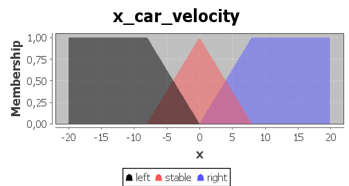
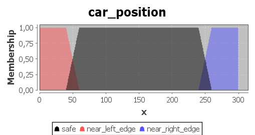
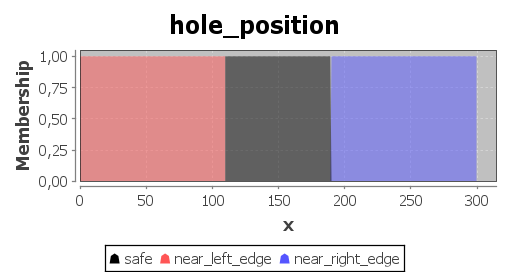
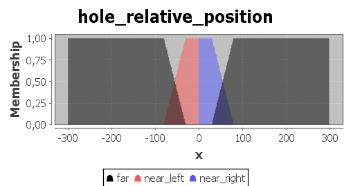
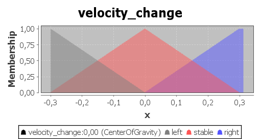
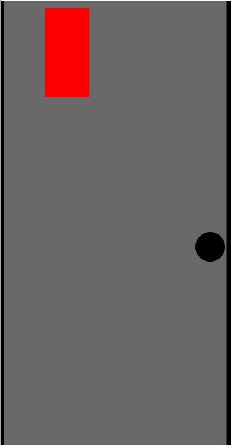

# Car Driver
Car driver that avoids obstacles on road using [jfuzzylogic](http://jfuzzylogic.sourceforge.net/html/index.html) librarry for fuzzy logic and javaFx for visualization.

## fuzzy controls
### controller inputs
#### `x_car_velocity`
specifies car's velocity along x-axis  

#### `x_car_velocity`
specifies car's velocity along x-axis  

#### `car_position`
specifies car's position on road  

#### `hole_position`
specifies obstacle's position on road  

#### `hole_relative_position`
specifies obstacle's position relative to the car  

### controller output
#### `velocity_change`
specifies velocity change along x-axis that will result in obstacle avoidance  
  
## Rules book
RULE 0: IF car_position IS near_left_edge THEN velocity_change IS right;  
RULE 1: IF car_position IS near_right_edge THEN velocity_change IS left;  
  ● rules 0 and 1 are responsible for avoiding road's edges   
RULE 2: IF hole_relative_position IS near_left AND hole_position IS safe THEN velocity_change IS right;  
RULE 3: IF hole_relative_position IS near_right AND hole_position IS safe THEN velocity_change IS left;  
  ● rules 2 and 3 are responsible for obstacle avoidance while the obstacle is at the centre of the road   
RULE 4: IF hole_relative_position IS NOT far AND hole_position IS near_left_edge THEN velocity_change IS right;  
RULE 5: IF hole_relative_position IS NOT far AND hole_position IS near_right_edge THEN velocity_change IS left;  
  ● rules 4 and 5 are responsible for obstacle avoidance while the obstacle is near the road's edge   
RULE 6: IF hole_relative_position IS far AND car_position is safe AND x_car_velocity IS left THEN velocity_change IS right;  
RULE 7: IF hole_relative_position IS far AND car_position is safe AND x_car_velocity IS right THEN velocity_change IS left;  
  ● rules 6 and 7 are responsible reducing velocity along x-axis when the obstacle is not ahead   
  
## Result
(note that gif has lower frame rate than the actual simualtion)  

